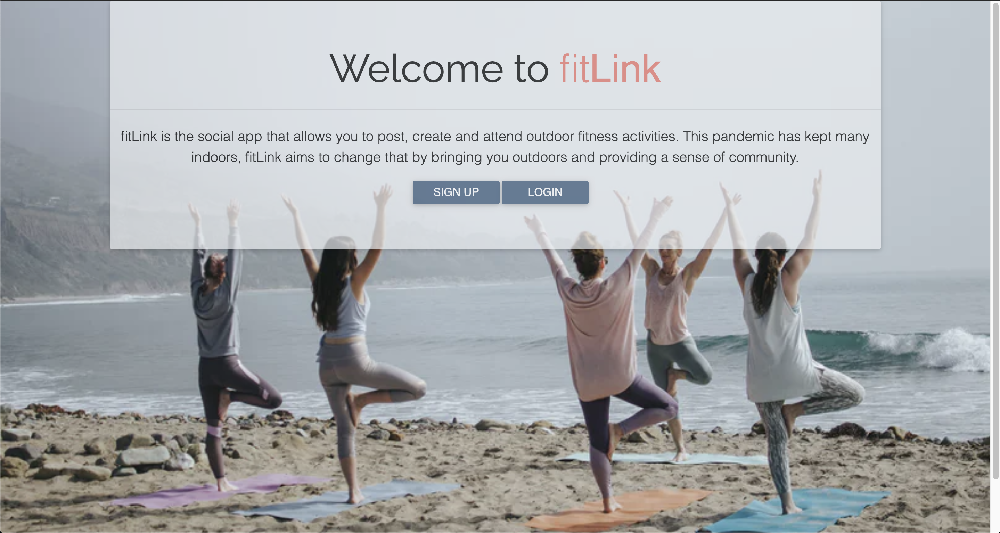

# fitLink
> This project includes edits and add-ons that I made after our group project was delivered. The original project is listed below for reference. The original project only has the Create and Read from the database functioning. I've included the Update & Destroy.

## Installation - Updated Project
> npm i  
> npm start

## Description:
> fitLink is a social application that helps users find outdoor fitness activities with others. During this pandemic most individuals have found themselves locked indoors and possibly becoming more anti-social than one would prefer, fitLink gets you outdoors and allows you to be apart of a community. When you access our application, you have the ability to sign up or log in and then can view different outdoor activities and events. As a member, you can also create an event for others to attend.

### Original Project & Contributors: Tyshia, Kim, Leonard, Nick
[Team Repository](https://github.com/kmarzi/fit-link)

[fitLink Heroku App](https://fit-link.herokuapp.com/)
